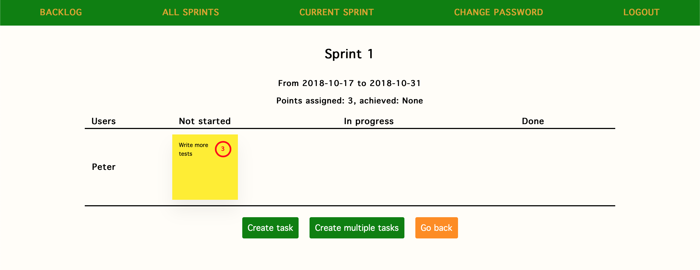

# Scrumdjango

## Prerequisites

This app was written and tested using Python 3.7.1.

## Installing

Clone the repository:

```sh
git clone https://github.com/piotrwolanin/scrumdjango.git
```

Install all the required Python dependencies using Pipenv and the provided `Pipfile.lock`:

```sh
pipenv install
```

Alternatively, there is a `requirements.txt` available if you do not use Pipenv.

This project makes use of the `python-decouple` package for handling environemnt variables. Make sure to define your `SECRET_KEY` inside a `.env` file in the `scrumdjango` folder. For production, you need to also specify `DB_NAME`, `DB_USER`, `DB_PASSWORD` and `DB_HOST` variables.

## Basic usage

Go through the standard Django database migrations and add at least one user (not shown). This will enable you to log into the app after starting the server.

The controls for adding sprints, tasks and backlog items are pretty self-explanatory, as shown in the screenshot below.

<p align="center">

</p>
